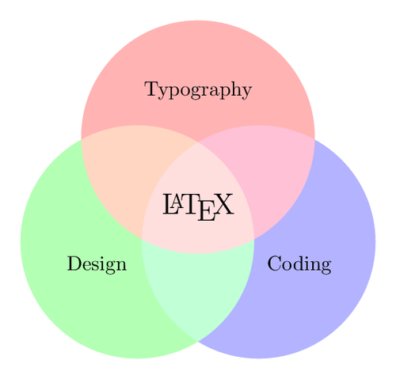

---
# Just for example purposes, a random lorem ipsum text for the abstract
header-includes:
    - \usepackage{blindtext}
# Basic variables
title: 'Title'
author: Author
date: City, \today
lang: en
abstract: \blindtext
# If custom title is commented, pandoc should show the standard title
custom-titlepage: exampletitlepage
# Global options
mainfont: Arial
monofont: Fira Mono # Checkout https://github.com/tonsky/FiraCode
fontsize: 11pt
linestretch: 1
geometry: "a4paper, top=2.5cm, bottom=2.5cm, left=3cm, right=3cm"
# Bibliography file and options
bibliography: references.bib
link-citations: true
# Citation Style Language
csl: ieee.csl
# Table of contents
toc: true
# Number sections
numbersections: true
# List of figures
lof: true
# List of tables
lot: false
# If there is only latex-style images, uncomment the following line
# graphics: true
---

# Section Example

Reference example @ref-name.

## Subsection example

This is a figure example (figure \ref{fig:example-latex}).

\begin{figure}[H]
    \centering
    \caption{Figure example.\label{fig:example-latex}}
    \includegraphics[width=0.5\textwidth]{./img/example.png}
\end{figure}

Another way of including images (figure \ref{fig:example-markdown}):

{width=50%}

# References section
